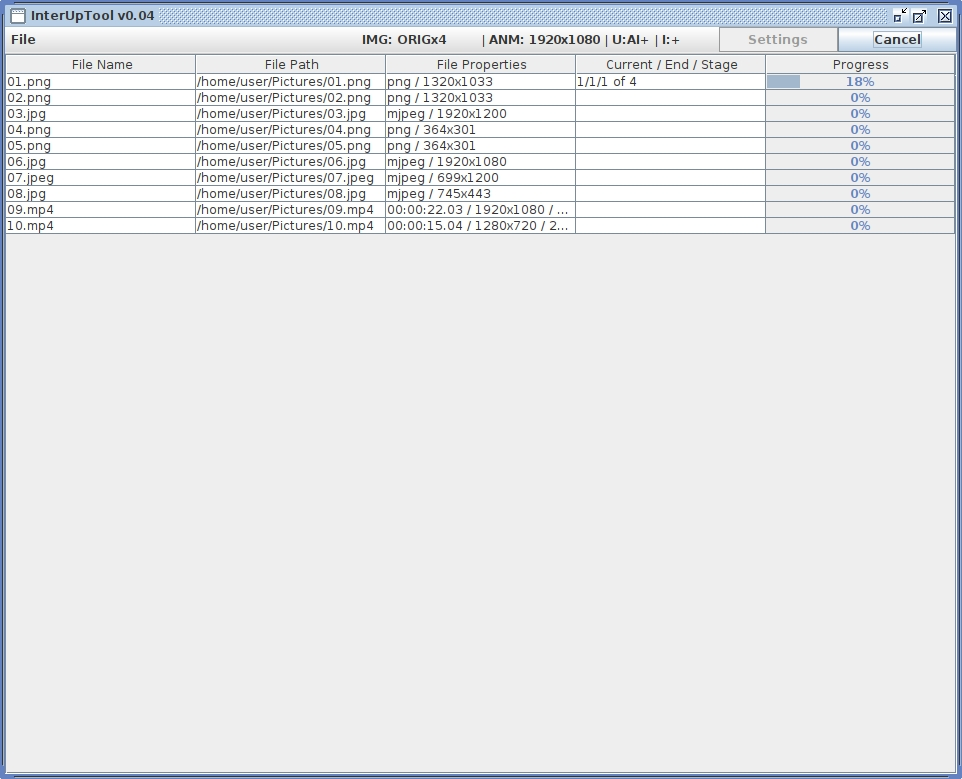

# InterUpTool
GUI Tool for control, queue and automate video enhancing process, provided by FFMPEG video encoder, Real-ESRGAN image upscaler and RIFE/DAIN video frame interpolators.

# Inference

  

# WIP:
- Dark Theme
- Static images upscaling (jpg/png/webp)
- Animated images upscaling (gif/apng/webp)