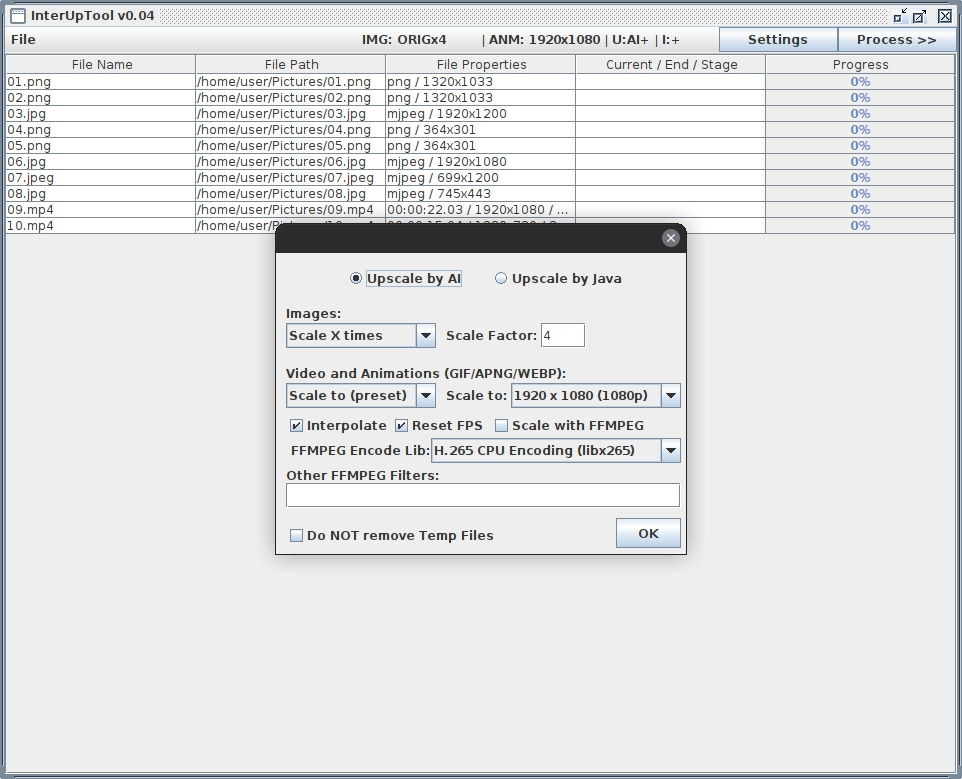

# InterUpTool
GUI Tool for control, queue and automate video enhancing process, provided by FFMPEG video encoder, Real-ESRGAN image upscaler and RIFE/DAIN video frame interpolators.

# Inference
<p align="center">
  
</p>

## Run parameters

```console
Usage: java -jar ./interuptool_v0.02.jar [options]...

  Help:
    -h                  print this help end exit

  Output:
    -v                  prints to 'console out' current file information
    -vv                 same as -v, additionaly prints to 'out' execution commands per stage
    -vvv                same as -vv, additionally prints to 'out' all child processes output

  Temp files handling:
    -nodel              any one of this 4 arguments will turn OFF
    -nodelete           temporarily created files deletion, such as
    -temp               extracted audio and image frames, both
    -tempfiles          extracted from video and after all stages
```

# WIP:
- Dark Theme
- Animated images upscaling (gif/apng/webp)